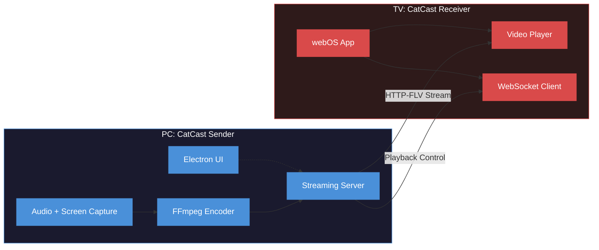

<div align="center">
  
  
  # CatCast

  **Local Screen Casting Application for LG webOS TVs**

  [](https://electronjs.org/)
  [](https://nodejs.org/)
  [](https://webostv.developer.lge.com/)
  [](https://socket.io/)
  [](https://ffmpeg.org/)
  [](https://opensource.org/licenses/MIT)
</div>

<br />

**CatCast** takes a different approach to screen casting. Instead of relying on Miracast, Chromecast, or any dedicated casting hardware, it streams over a plain local network connection, no special Wi-Fi chipsets, no wireless display receivers, no proprietary protocols required.

As long as the PC and TV share the same network (wired or wireless), CatCast captures the desktop, encodes it with FFmpeg, and delivers the stream directly to the TV client. This makes it work in situations where conventional casting typically fails: desktop PCs on Ethernet, systems without Miracast-capable adapters, or TVs with no built-in wireless display support.

<div align="center">
  

<br/>
<em>Desktop sender interface</em>

&nbsp;
</div>

## Features

- **Low-Latency Streaming** - Network delivery via WebSockets and local HTTP-FLV keeps the stream responsive on a home network.
- **Native Audio Capture** - A custom C++ WASAPI integration captures audio directly from the Windows sound subsystem, providing reliable loopback without virtual audio drivers.
- **Dedicated webOS Client** - A lightweight receiver application runs natively on the TV, removing the need for any external hardware like a Chromecast or Fire Stick.
- **HUD Statistics** - An on-screen overlay (toggled with the `ⓘINFO` button or Magic Remote) displays live stream metrics including FPS, latency, and resolution.
- **Hardware Acceleration** - GPU encoding is supported for NVIDIA and AMD cards, reducing CPU load on the host machine.

<div align="center">


<br/>
<em>Settings panel</em>

&nbsp;
</div>

## Architecture

The application is split into two components: a **Sender** running on a Windows PC and a **Receiver** installed directly on the LG TV.

FFmpeg handles video encoding with optional hardware acceleration (NVIDIA/AMD). Audio is captured at the driver level via a custom C++ WASAPI module - this avoids the need for virtual audio drivers and works reliably across all Windows applications. The encoded stream is delivered over the local network via Node Media Server using HTTP-FLV, chosen for its low overhead and broad compatibility over alternatives like RTSP. The TV client connects by entering the host PC's IP address via WebSocket.



## Getting Started

CatCast operates on a client-server model. The **Sender** runs on a Windows machine to capture and encode the stream; the **Receiver** is deployed directly onto the LG webOS TV.

### Prerequisites

- **Host Machine:** Windows is required. The `wasapi_capture` module uses the Windows Audio Session API for driver-level audio loopback - the Sender cannot run on macOS or Linux.
- **Network:** Both the PC and TV must be on the same local network (LAN or WLAN).

### 1. Sender (Windows PC)

#### Standard Installation (Recommended)
Prebuilt binaries are available in the **[Releases](https://github.com/brwch/catcast/releases)** section.
- **Installer (`CatCast Sender Setup x.x.x.exe`)** - Standard installation with OS integration (e.g., run on startup).
- **Portable (`CatCast Sender x.x.x.exe`)** - Standalone binary, no installation needed.

#### Building from Source
```bash
git clone https://github.com/brwch/catcast.git
cd catcast/catsender
npm install
npm start
```

### 2. Receiver (LG TV)

Deploying to the TV requires enabling LG Developer Mode. A pre-compiled `.ipk` package and an automated deployment script (`deploy.ps1`) are included in the repository to simplify this.

☛ **[TV Deployment Guide](./TV_INSTALLATION.md)**

### 3. Start Streaming

1. **Start the Sender** on your Windows PC. Note the **Local IP** shown in the UI.
2. **Launch CatCast** on your LG TV.
3. **Enter the IP address** (e.g., `192.168.1.15`) in the TV interface and connect.

## Known Limitations

- **Individual window capture** - Due to how GPU-accelerated windows interact with FFmpeg's capture pipeline, some application windows render incorrectly or appear black when targeted directly. Full desktop capture works without issues.
- **Windows only** - The WASAPI audio module is Windows-specific. Linux and macOS are not supported.

## Project Status

CatCast is stable and meets its core goals: full desktop streaming to an LG TV over a local network, with low latency and hardware-accelerated encoding. The project is open-source and contributions or bug reports are welcome.

---

Built as a personal project to solve a real casting problem - exploring low-level audio/video streaming, Electron desktop development, and webOS application deployment.

